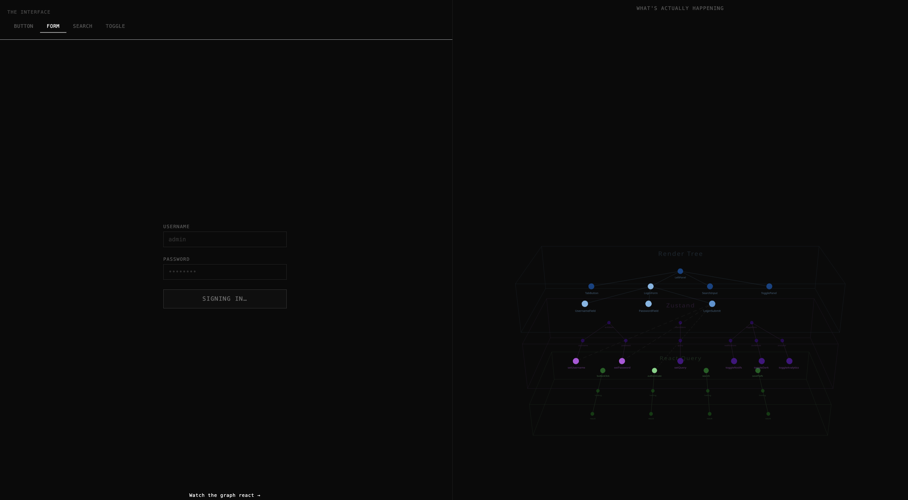

# react-trace-visual

An interactive 3D visualization of the React rendering stack — trace component renders, state updates, Zustand store actions, and async queries in real time.



## What it does

- Instruments React components, hooks, and Zustand stores without modifying application code
- Visualises the component tree and render relationships as an interactive 3D graph (React Three Fiber)
- Shows live event timelines: renders, state diffs, query lifecycle, custom user events
- Left panel lets you inspect individual nodes; right panel shows event history and filter controls

## Quick start

```bash
bun install
bun dev
```

Open [http://localhost:5173](http://localhost:5173).

## Tech stack

- TypeScript + React 19
- [React Three Fiber](https://docs.pmnd.rs/react-three-fiber) + [@react-three/drei](https://github.com/pmndrs/drei) — 3D scene
- [Zustand](https://zustand-demo.pmnd.rs/) — state management
- [TanStack Query](https://tanstack.com/query) — async data layer
- [D3 hierarchy](https://d3js.org/d3-hierarchy) — tree layout
- [Leva](https://github.com/pmndrs/leva) — debug controls
- [Vite](https://vitejs.dev/) — dev server and bundler

